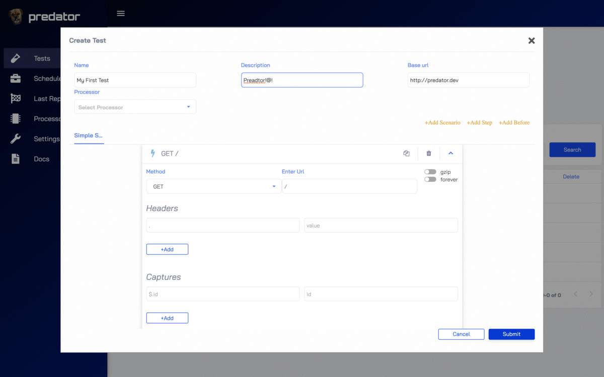
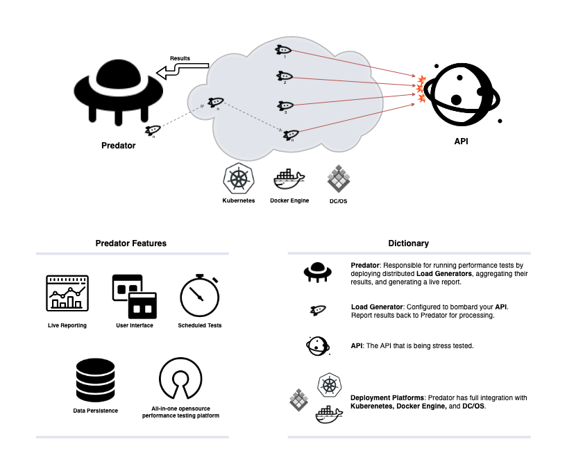
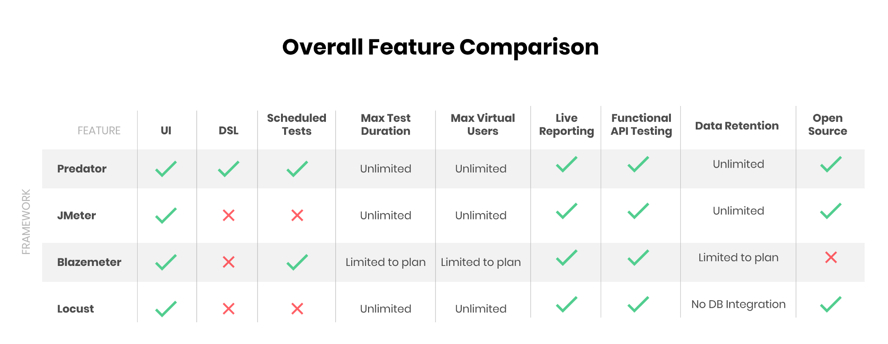

# Introducing Predator

**Distribute open source performance testing platform for APIs.**

Requests per second, request latency, and overall system performance and reliability are some fundamental concepts that need to be taken into account when designing a high capacity API. With CI/CD becoming a common deployment methodology, deployments to production are a constant occurrence. So how can you ensure that the core capabilities you initially designed your system to have remain intact? 

The answer is: use Predator! 

Predator is a performance platform that can be configured to automatically load your API with scheduled tests that provide in-depth performance metrics. While sipping on your (morning) coffee, you can simply check the test summaries to make sure your system is performing as expected. By comparing test results to results from previous test runs, you can easily identify system-wide regressions. Predator’s integration with custom dashboards, test metrics, and service logs make pinpointing performance bugs painless,especially when you check up on the system on a daily basis.

## Main Features

- **Distributed load**:  Predator supports an unlimited number of load generators that produce multiple load runners concurrently.

- **Real time reports**: Predator aggregates all concurrent runs into a single beautiful report in real time (latency, rps, status codes and more).

- **Built for the cloud**:  Predator is built to take advantage of Kubernetes and DC/OS. It's integrated with those platforms and can manage the load generators lifecycles by itself.

- **One click installation**:  Predator can be installed with just one click in Kubernetes and DC/OS, or on any other machine running Docker.

- **Supports 5 Different databases**: Predator provides out-of-the box functionality for persisting data in Cassandra, Postgres, MySQL, MSSQL and SQLITE.

- **Scheduled jobs**: Predator can run recurring tests using cron expressions.

- **3rd partry metrics**: Predator comes integrated with Prometheus and Influx. Simply configure it through the predator REST API or using the UI.

- **Rich UI**: Predator offers a rich UI along with a powerful REST API.

- **Based on [artilliery.io](https://github.com/artilleryio/artillery)**: Predator uses artillery as its 
load engine to fire the requests. The schema for creating tests via the Predator REST API is based on the artillery schema.

## UI

## Under the hood

## Feature Comparison

