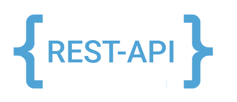

The Predator API gives you advanced control over the tests you create and allows you utilize functionalities not available through the Predator UI. For instance, using the API you can [create DSL definitions](tests.md#request-reuse-with-dsl-definitions) and reuse them in your requests. 

Go ahead and dig into our <a href="https://zooz.github.io/predator/indexapiref.html#section" target="_blank">Predator API documentation.</a>

