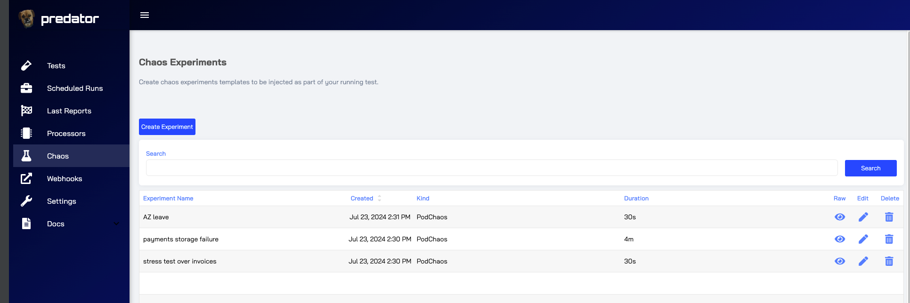
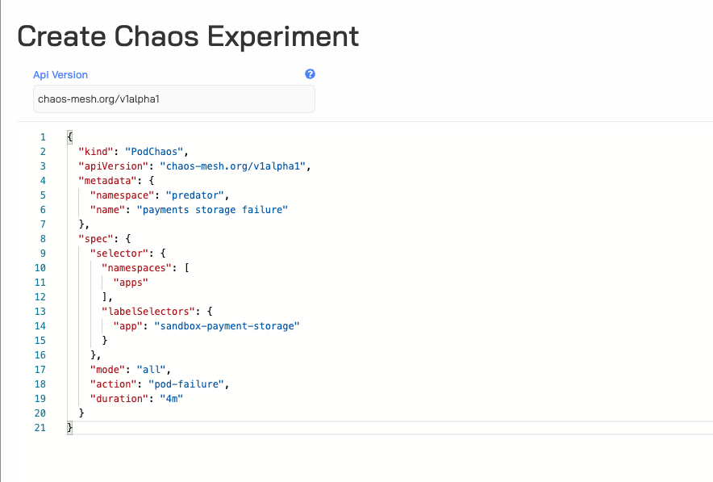
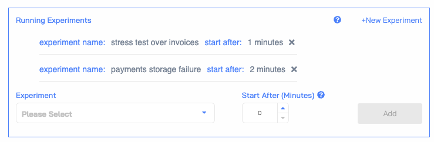
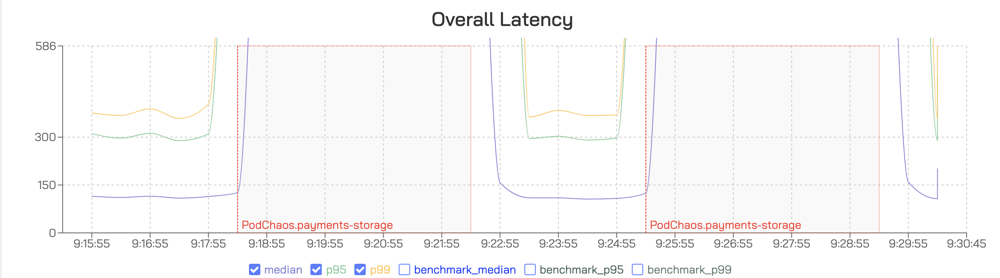
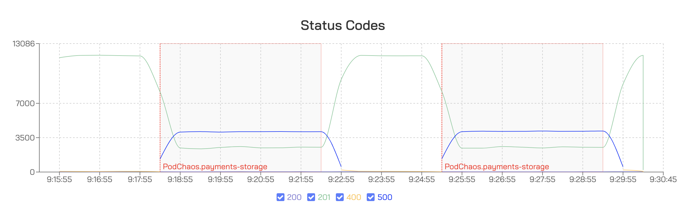

# Integrating Chaos Mesh with Predator

!!! TIP "Supported from version zooz/predator:1.7.0"
!!! TIP "Supported only in Kubernetes"

## Introduction

**Overview**:  
Chaos Mesh is an open source cloud-native Chaos Engineering platform. 
It allows you to conduct chaos experiments by injecting various faults into Kubernetes applications to test their resilience and robustness.

**Purpose**:  
Chaos Mesh helps Kubernetes users identify and fix potential issues by simulating real-world failures. This ensures applications can handle disruptions and maintain a seamless user experience. It integrates natively with Kubernetes for efficient chaos engineering experiments.

**Target Audience**:

1. **Kubernetes Administrators**: Managing Kubernetes clusters.
2. **DevOps Engineers**: Implementing CI/CD pipelines and infrastructure stability.
3. **SREs**: Ensuring the reliability of Kubernetes-based applications.
4. **Developers**: Building and deploying resilient applications on Kubernetes.

**Supported Chaos Kinds**:  
Chaos Mesh supports various kinds of chaos experiments, including but not limited to:

- **Pod Chaos**: Simulate pod failures and delays.
- **Network Chaos**: Simulate network latency, packet loss, and network partitions.
- **File System Chaos**: Simulate file system errors such as I/O delays and read/write errors.
- **Kernel Chaos**: Inject faults into kernel functions.
- **Time Chaos**: Manipulate the system time of containers.
- **HTTP Chaos**: Simulate HTTP faults like delays, aborts, and status code modifications.
- **Stress Chaos**: Inject CPU and memory stress to test the application's behavior under high resource usage.

!!! TIP "For further knowledge please read chaos mesh [chaos mesh docs](https://chaos-mesh.org/docs/)"

## Installation
**Prerequisites**:  
Before integrating Chaos Mesh with Predator, ensure you have the following prerequisites:

**Installing Chaos Mesh**:  
To install Chaos Mesh in your Kubernetes cluster, follow the instructions provided in the [Chaos Mesh quick start guide](https://chaos-mesh.org/docs/quick-start/).

**Verifying Installation**:  
Ensure that Chaos Mesh is correctly installed and running in your Kubernetes cluster. Refer to the [verification steps](https://chaos-mesh.org/docs/quick-start/#verify-the-installation) in the quick start guide for more details.

**Integrating Chaos Mesh with Predator**: Update service configuration helm with option
- Using Helm
  ```bash
  # chaosMesh.enabled=true
  ```
This option will create cluster role and cluster role binding to perform actions like: create / get / delete on chaos CRDS

## Creating Your First Chaos Experiment
Chaos experiments management is available under *Chaos* tab


Create experiment is done by creating a json formatted kubernetes resource


It is advised to use chaos mesh dashboard to generate the appropriate resource
[create and run chaos experiments](https://chaos-mesh.org/docs/run-a-chaos-experiment/)

## Adding Chaos Experiments to Predator Tests
An experiment can be added to a test through the job creation form.
The test can include a list of experiments by selecting an experiment to add and specifying the time at which the experiment should be initiated.


## Viewing and Interpreting Reports
Experiments time range and its implications on test results are visible in the reports




