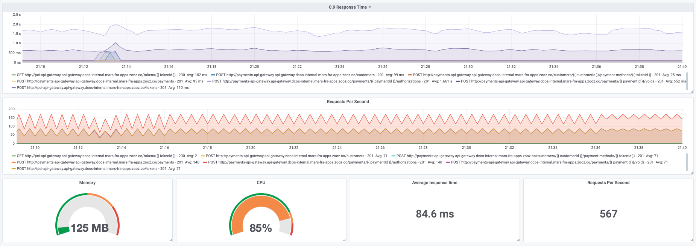

# Frequently Asked Questions

## Installation

### <b>Predator is running, how do I access the UI?</b>

The UI is accessible at http://$MACHINE_IP/ui where `$MACHINE_IP` is your local network address you used to install Predator.
                        
## Tests

### <b>I run a test successfully but no report is created for the test</b>

The Predator-Runner docker that is reporting the test results back to Predator isn't able to connect to it, 
which is why the test runs but no report is generated. When installing Predator in Docker, the following command is used:
```
docker run -d -e JOB_PLATFORM=DOCKER -e INTERNAL_ADDRESS=http://$MACHINE_IP:80/v1 \
-p 80:80 --name predator -v /var/run/docker.sock:/var/run/docker.sock zooz/predator
```

The `INTERNAL_ADDRESS=http://$MACHINE_IP:80/v1` is what the Predator-Runner uses to communicate with Predator, 
and `$MACHINE_IP` needs to be your local network address (an IP address). You can get it by running the command: 
```
ifconfig en0 | grep 'inet ' | cut -d' ' -f2
```

For more information regarding correct installation of Predator using Docker visit the <u>[Installation](installation.md#docker)</u> section.

It is important to note this is an issue and solution only in Docker installations. 
In Kubernetes and DC/OS installations the `INTERNAL_ADDRESS` is built in.

### <b>What is the http engine Predator uses to run the load?</b>

Predator uses <u>[Artillery](https://github.com/artilleryio/artillery)</u> as its HTTP load engine. 
Therefore, all `basic` type tests are written in Artillery syntax and all of the features Artillery supports, Predator supports.

To read more about Artillery and its features visit their well written documentary: 
<br>
- <u>[Artillery Documentation](https://artillery.io/docs/)</u>
<br>
- <u>[Artillery Basic Concepts Documentation](https://artillery.io/docs/basic-concepts/)</u>
<br>
- <u>[Artillery Test Structure Documentation](https://artillery.io/docs/script-reference/)</u>
<br>
- <u>[Artillery HTTP Engine Documentation](https://artillery.io/docs/http-reference/)</u>
<br>

### <b>I want to use Predator's API, where can I find examples for creating advanced/dsl tests?</b>

Here is a <u>[postman collection](https://documenter.getpostman.com/view/220627/S1TYTvP2?version=latest)</u> which contains examples
for creating tests with custom javascript and dsl definitions.

### <b>What content-type does Predator support in its HTTP requests?</b>

While the Predator UI currently supports creating tests only with `content-type: application/json` body, the actual Predator API has no such limit.
When creating a test through the API, instead of specifying in the `post` request a `json` key, specify `body` key and change the `content-type` header to the appropriate content-type being used.<br>
For example:<br>

```JSON
  {
  	"post": {
  		"url": "/orders",
  		"headers": {
  			"Content-Type": "text/html"
  		},
  		"body": "Not Json :)"
  	  }
  }
```
In this example, the content-type used in the request is `text/html` and the body sent: "Not JSON :)" will be in that format.

## Configuration

### <b>I deployed Predator with Kuberenetes/Metronome but I need to customize the predator-runner job configuration (change CPU, memory, add image pull policy, etc).</b>

!!! TIP "Supported from version zooz/predator:1.4.0"

This is possible by configuring Predator with the `custom_runner_definition` parameter. This is a JSON value that will 
be merged with the runner job definition when creating new jobs in both Kuberenetes and Metronome platforms. 

Example usage for Predator deployed with Kubernetes and need to change memory/cpu requests and limits while adding security context and image pull secrets:
```
curl -X PUT \
  http://PREDATOR-API-URL/v1/config \
  -H 'Content-Type: application/json' \
  -d '{
	"custom_runner_definition": {
		"spec": {
			"template": {
				"spec": {
					"imagePullSecrets": [{
						"name": "****"
					}],
					"securityContext": {
						"runAsUser": 1000
					},
					"containers": [{
						"resources": {
							"requests": {
								"memory": "128Mi",
								"cpu": "0.5"
							},
							"limits": {
								"memory": "1024Mi",
								"cpu": "1"
							}
						}
					}]
				}
			}
		}
	}
}'
``` 
This will spawn each predator-runner with the desired specs. 

Note: this parameter is applied <b>globally</b>, meaning that <b>all</b> runners will be applied the above specs once configured.
Of course, it's possible to delete this configuration if it is not needed anymore by applying the `DELETE` method on the `/v1/config/custom_runner_definition` API.

### <b>I ran Predator with SQLITE and would like to migrate now to a different database. How do I do this?</b>

Migration between different databases is not possible. 
In order to run Predator with a different supported database, 
you must restart Predator with the new <u>[configuration](configuration.md#database)</u>.

## Metrics

### <b>Does Predator support exporting metrics to external time series databases?</b>

Yes, Predator has integration with both <u>[Prometheus](https://prometheus.io)</u> and <u>[InfluxDB](https://www.influxdata.com/)</u>, and can export metrics by test endpoints and status codes, something that is currently is not available to configure in the Predator UI, but is supported through the API.

### <b>How can I export metrics to Prometheus?</b>

<u>[Prometheus](https://prometheus.io)</u> by its nature is a scraper, while the Predator-Runner is a job without a specific API and finite time life.
To overcome this:  
1. Deploy <u>[Prometheus](https://github.com/prometheus/prometheus)</u>  
2. Deploy <u>[Prometheus push gateway](https://github.com/prometheus/pushgateway)</u>  
3. <u>[Configure](configuration.md#prometheus)</u> Predator to push metrics to the push gateway.  
4. Configure Prometheus to scrape from the push gateway.  

### <b>Is there any dashboard for Grafana I can use?</b>

<u>[This](https://grafana.com/grafana/dashboards/11651)</u> dashboard for example configured to read from Prometheus.


