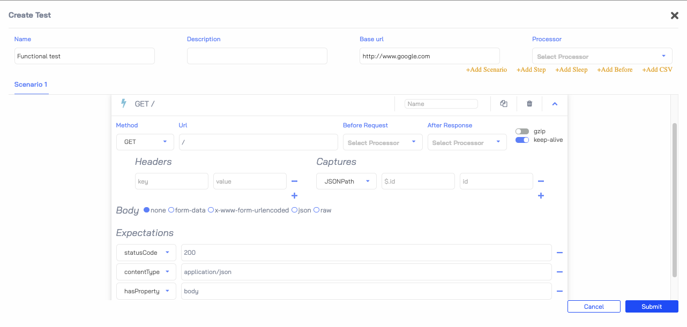

# Functional Tests and Assertions
!!! TIP "Supported from version zooz/predator:1.5.0"

Load tests are important to stress the system and see how it is dealing with the stress. The actual functionality and acceptance tests are not usually tested in load tests.
For this, Predator offers running **functional tests with assertions**.

## Creating a Functional Tests
Functional tests are created in the same manner as the load tests. When creating functional tests, 
it's advised to add expectations so that you will be informed in the report if the acceptance tests passed or not.
These expectations will be checked for each response received in the test and the report will display the assertion results.

### Expectations
The possible expectations that can be created to assert the response received:

- statusCode
- contentType
- hasProperty
- hasHeader
- equals
- matchesRegexp

### Example

A simple functional test that sends a GET request to `http://www.google.com/` and asserts that the response received has:

- statusCode: `200`
- contentType: `application/json`
- hasProperty: `body`
 

## Running a Functional Tests 
In order to run the created test as a functional test and not a load test, the only difference is the actual load we run. 
For this we need to create a job with type `functional_test` and `arrival_count` as the rate parameter (instead of `arrival_rate` in load_tests).
This means that for the test duration, the test will send the amount of requests that are configured in the `arrival_count` param.

**Example**: A test duration of 10 minutes with `arrival_count = 600` will result in 1 request per second.