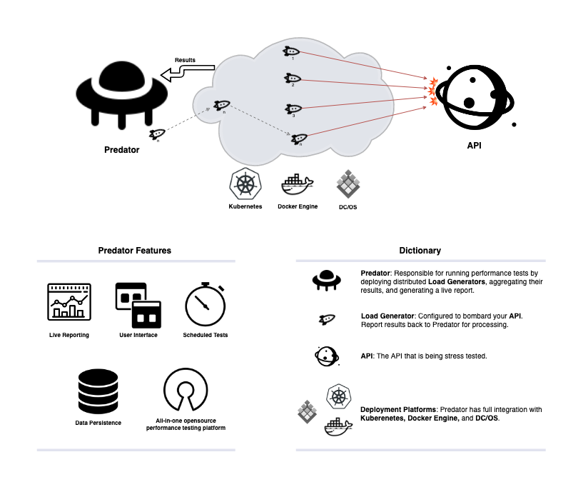
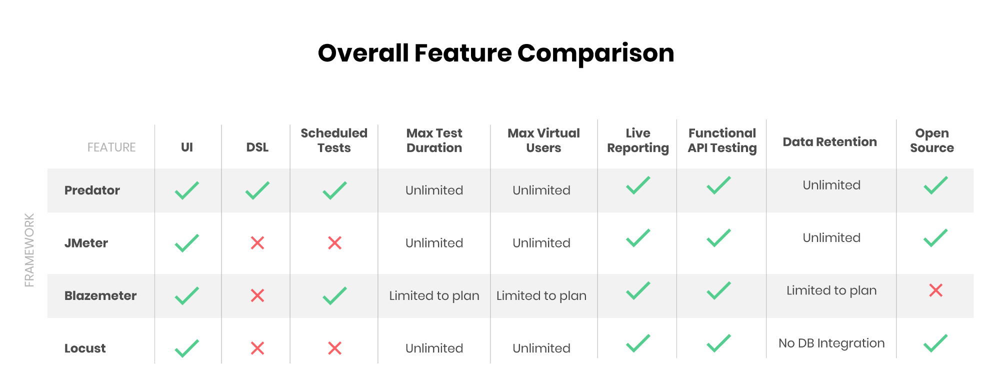

# Introducing Predator

**Distributed open source performance testing platform for APIs.**

Requests per second, request latency, and overall system performance and reliability are some fundamental concepts that need to be taken into account when designing a high capacity API. With CI/CD becoming a common deployment methodology, deployments to production are a constant occurrence. So how can you ensure that the core capabilities you initially designed your system to have remain intact? 

The answer is: use Predator! 

Predator is a performance platform that can be configured to automatically load your API with scheduled tests that provide in-depth performance metrics. While sipping on your (morning) coffee, you can simply check the test summaries to make sure your system is performing as expected. By comparing test results to results from previous test runs, you can easily identify system-wide regressions. Predator’s integration with custom dashboards, test metrics, and service logs make pinpointing performance bugs painless,especially when you check up on the system on a daily basis.

## Main Features
- **Distributed load**:  Predator supports unlimited number of load generators that produce load concurrently.
- **Real time reports**: Predator aggregate all concurrent runs into one beautiful report in real time (latency, rps, status codes and more)
- **Built for the cloud**:  Predator is built to take advantage of Kubernetes and DC/OS. it's integrated with those platform and is able to manage the load generators life cycles by it self.
- **One click installation**:  Installed via one click in Kubernetes, DC/OS, or any other machine that has Docker.
- **Supports 5 Different databases**: Predator can adjust it self to persist data in Cassandra, Postgres, MySQL, MSSQL and SQLITE out of the box.
- **Scheduled jobs**: Run any tests in recurring mode by cron expression.
- **3rd partry metrics**:  Predator integrated with Prometheus and Influx, just configure it via the config endpoint or the ui.
- **Rich UI**: Predator offers rich UI side by side powerful REST API.
- **Based on [artilliery.io](https://github.com/artilleryio/artillery)**: Predator uses artillery as its load engine to fire the requests. The schema of creating tests via api is based on artillery schema.

## UI

## Under the hood

## Feature Comparison

