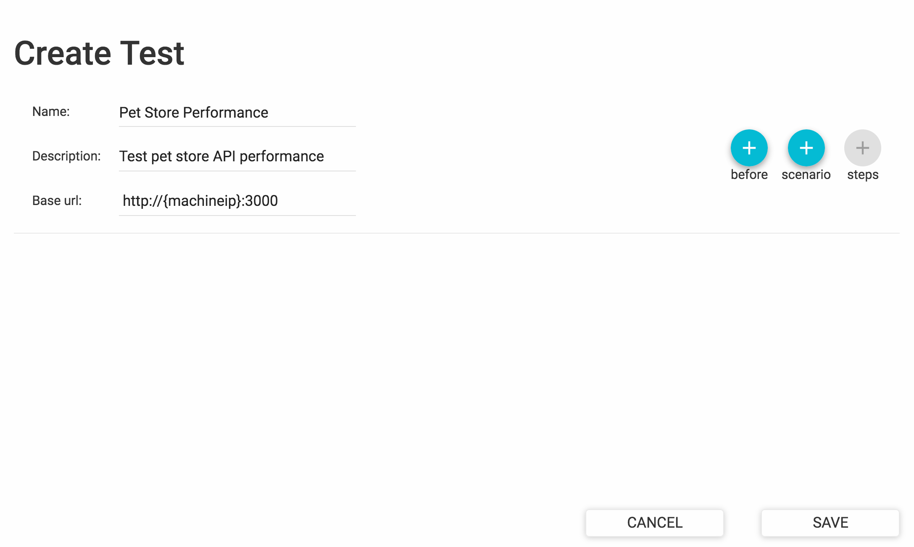
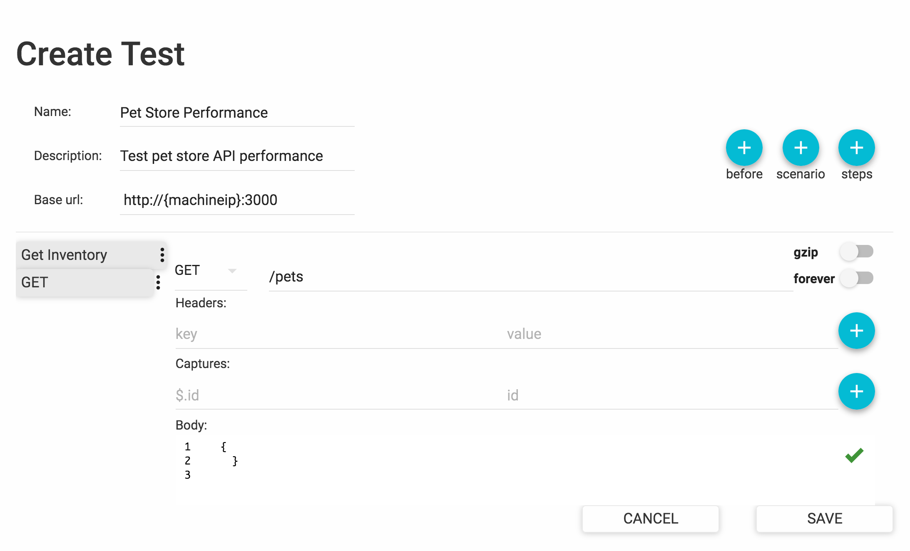

# Adding your First Test

In this section, we will walk you through the steps of creating a simple test in Predator. It will allow you to familiarize yourself with some basic concepts, before moving onto some more advanced features later on. 

!!! note "Following along with the examples"
    To make it easy for you to follow along with the steps below, we created a demo Predator docker image. This image allows you to invoke our fictitious petstore API, used in the examples that follow. You can retrieve and run the docker image with the following command (just make sure to replace {MACHINE_IP} with the IP address of your own machine):

    ```
    docker run -d -p 3000:3000 --name predator-petstore zooz/predator-builds:petstore    
    ```


    
Adding a new test is easy. From the Predator web interface, choose **Tests** > **View Tests**. Then click **Create Test** and complete all fields on the form, like so:




## Test Scenarios

Now proceed to add one or more test **scenarios**. A scenario is a sequence of HTTP requests aimed to test the performance of a single piece of functionality. For instance, a scenario could test the performance of multiple users requesting information about a specific pet simultaneously. Another scenario could be ordering a pet from the pet store. 

To add a new scenario, create a new test or edit an existing one. Then click the **scenario** button and do the following:

* Set a **scenario weight**. Allows for the probability of a scenario being picked by a new virtual user to be "weighed" relative to other scenarios. If not specified, each scenario is equally likely to be picked.

* Click the **Steps** button to add **scenario steps**. This allows you to add the  .

Here's a sample scenario that fetches the inventory from the pet store:




## Pre-scenario Requests

Sometimes a prerequisite must be fulfilled before your scenarios can actually work. For example, pets must already have been created before you can fetch them from the inventory. This is where a **pre-scenario request** comes into play. A pre-scenario request is an HTTP request that Predator executes before running the scenarios in your test.

To add a pre-scenario request, create a new test or edit an existing one. Then click the **before** button and add all request specifications. 

## HTTP Request Properties

When adding scenario steps or pre-scenario requests, you will need to define the properties of the HTTP request that will be invoked:


While most of the properties are self-explanatory, the following items may require some additional explanation:

* **gzip**: This will compress the request body. 

* **forever**: Indicates whether the connection to the endpoint will be kept alive.

* **Captures**: Allows you to extract (capture) data from the request response and store it in a variable for reuse in another request. See [Data Reuse with Variables](tests.md).


# Running the Test

With all scenarios in place, let's go ahead and run the test.

Predator executes tests through so-called **jobs**. To create a job, choose **Tests** > **View tests**. Then click **RUN** for the test you want to execute and complete all fields in the **Create new job** dialog. When done, click **SUBMIT**. Depending on your configuration, the job will either execute immediately or at scheduled intervals.

!!! note
    To see the intervals at which your jobs will run, see [Scheduled Tasks](schedulesandreports.md#scheduled-tasks).

The following table explains the job parameters you can configure:

<table style="width:100%">
    <tr>
      <th>Setting</th>
      <th>Description</th> 
    </tr>
    <tr>
      <td>Notes</td>
      <td>Free text describing the job.</td> 
    </tr>
    <tr>
      <td>Arrival rate</td>
      <td>The number of times per second that the test scenarios will run.</td> 
    </tr>
    <tr>
      <td>Duration (seconds)</td>
      <td>The time during which the test will run. In seconds.</td> 
    </tr>
    <tr>
      <td>Ramp to</td>
      <td>Used in combination with the <b>arrival rate</b> and <b>duration</b> values. Increases the arrival rate linearly to the value specified, within the specified duration.</td> 
    </tr>
    <tr>
      <td>Parallelism</td>
      <td>The number of runners that will be allocated to executing the test. The <b>arrival rate</b>, <b>duration</b> and <b>Max virtual users</b> will be split between the specified number of runners.</td> 
    </tr>
    <tr>
      <td>Max virtual users</td>
      <td>The maximum number of virtual users executing the scenario requests. This places a threshold on the number of requests that can exist simultaneously.</td> 
    </tr>
    <tr>
      <td>Environment</td>
      <td>Free text describing the environment against which the test is executed.</td> 
    </tr>
    <tr>
      <td>Cron expression</td>
      <td>A cron expression for scheduling the test to run periodically at a specified date/time. </td> 
    </tr>
    <tr>
      <td>Run immediately</td>
      <td>Determines if the test will be executed immediately when the job is saved.</td> 
    </tr>
    <tr>
      <td>New Email</td>
      <td>An email address to which Predator will send a message when the test execution is completed.</td> 
    </tr>
    <tr>
      <td>New Webhook</td>
      <td>A URL to which an event will be sent when the test execution is completed. The event body will include detailed information about the test, such as the number of scenarios that were executed and the number of requests that were invoked. </td> 
    </tr>
  </table>


# Viewing the Test Report

Your curiosity is probably reaching an all-time high right now, as Predator is working hard to push your API to its limits. So how's your API performing under all that pressure?

Predator's test reports will give you the in-depth performance metrics you're looking for. From the Predator UI choose **Reports** > **Last Reports** to view a detailed report of the test that was executed. For more information about the data shown in the test reports, see [Test Reports](schedulesandreports.md#test-reports).

