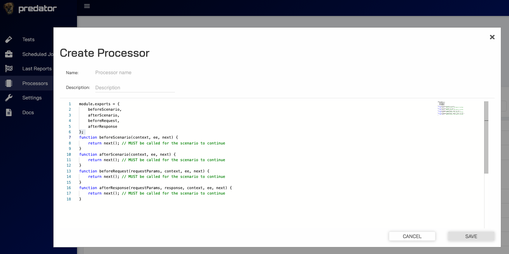
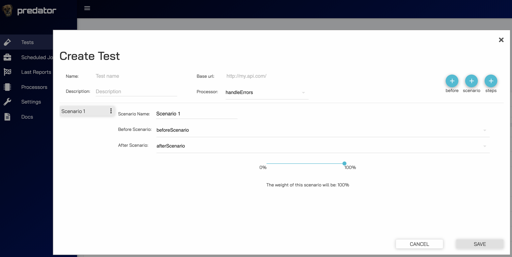
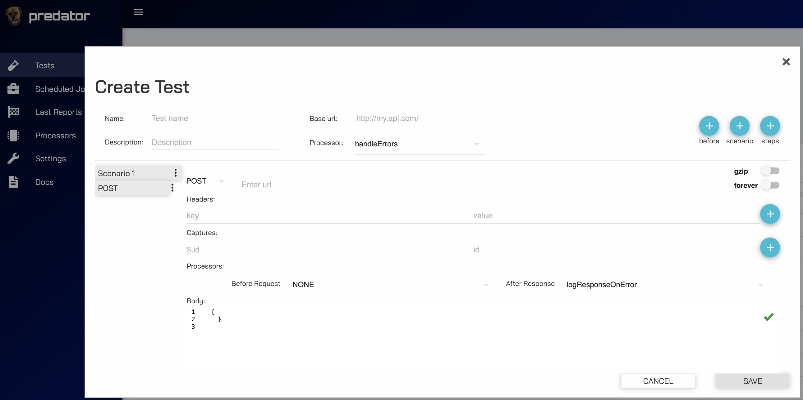

Processors are used to inject custom JavaScript into the test flows. This allows the test flow to be as flexible as possible by creating application resources along the way that are needed for future requests or flow processing.

!!! TIP
    **Processors allow you to create anything that's possible in JavaScript and integrate it seemlessly into your test flow.**

## Use-cases
There are many use-cases for injecting custom JavaScript into your test flow. Some include:

1. **Prerequistes for a request** 
    - Create resources needed for an API request, such as an authentication token, that shouldn't be calculated into the report's response times for the overall test flow.
     <br>[*Example*](#1-prerequistes-for-a-request)
2. **Random data generation** 
    - Generate random data to send in your request bodies
     <br>[*Example*](#2-random-data-generation)
3. **Response logging** 
    - Log errors if exist
     <br>[*Example*](#3-response-logging)

## Creating a processor
Creating a processor can be easily done through the Predator UI. An initial template is provided but it is not required to follow it, we recommend using appropriate function names in order to make it easier to import them into your tests. 

!!! note "Extra documentation"
    In order to read more documentation regarding how processors are used in artillery tests, 
    please refer to the <u>[artillery docs](https://artillery.io/docs/http-reference/#advanced-writing-custom-logic-in-javascript)</u>.



### Template
```
module.exports = {
    beforeScenario,
    afterScenario,
    beforeRequest,
    afterResponse
};
function beforeScenario(context, ee, next) {
    return next(); // MUST be called for the scenario to continue
}
function afterScenario(context, ee, next) {
    return next(); // MUST be called for the scenario to continue
}
function beforeRequest(requestParams, context, ee, next) {
    return next(); // MUST be called for the scenario to continue
}
function afterResponse(requestParams, response, context, ee, next) {
    return next(); // MUST be called for the scenario to continue
}
```

### Description
Since Predator uses Artillery's built-in processor functionality, there are 4 instances where the processor's Javascript code can be executed.

#### beforeScenario(context, ee, next)
These functions will be executed **once** before a scenario. All before scenarios functions must adhere to the `(context, ee, next)` parameters in their function signature.

#### afterScenario(context, ee, next)
These functions will be executed **once** after a scenario. All after scenarios functions must adhere to the `(context, ee, next)` parameters in their function signature.

#### beforeRequest(requestParams, context, ee, next)
These functions will be executed **once** before a specific request. All before requests functions must adhere to the `(requestParams, context, ee, next)` parameters in their function signature.

#### afterResponse(requestParams, response, context, ee, next)
These functions will be executed **once** after a specific request. All after response functions must adhere to the `(requestParams, response, context, ee, next)` parameters in their function signature.

### Use case examples:

#### 1. **Prerequistes for a request**
```
const uuid = require('uuid/v4');
module.exports = {
    createAuthToken
};

function createAuthToken(context, ee, next) {
    context.vars.token = uuid();
    return next(); // MUST be called for the scenario to continue
}
```
#### 2. **Random data generation**
```
module.exports = {
    generateRandomName
};

function generateRandomName(context, ee, next) {
    context.vars.name = 'random_name_' + Date.now();
    return next(); // MUST be called for the scenario to continue
}
```
#### 3. **Response logging**
```
module.exports = {
    logErrorByStatusCode
};

function logErrorByStatusCode(requestParams, response, context, ee, next) {
  if (response.statusCode >= 300) {
    console.log(`**************** fail with status code: ${JSON.stringify(response.statusCode)}`);
    console.log(`**************** response body: ${JSON.stringify(response.body)}`);
    console.log(`**************** response headers is: ${JSON.stringify(response.headers)}`);
    console.log(`**************** request body: ${JSON.stringify(requestParams.body)}`);
  }
  return next(); // MUST be called for the scenario to continue
}
```

## Using in a test
In order to load a processor into a test, choose a processor from the list `Processor` in the create/edit test screen. 
The exported functions from the processor will dynamically load into the `Before Scenario`, `After Scenario`, `Before Request`, `After Request`
dropdown menus.

### Example
In this example, we loaded a handleErrors processor with the following JavaScript:

```
const uuid = require('uuid/v4');
module.exports = {
    throwErrorOnError, logResponseOnError, beforeRequest, afterResponse, afterScenario, beforeScenario
};

function beforeRequest(requestParams, context, ee, next) {
    console.log('before request')
    return next(); // MUST be called for the scenario to continue
}

function afterResponse(requestParams, response, context, ee, next) {
    console.log('after response')
    return next(); // MUST be called for the scenario to continue
}

function afterScenario(context, ee, next) {
    console.log('after scenario')
    return next(); // MUST be called for the scenario to continue
}

function beforeScenario(context, ee, next) {
    console.log('before scenario')
    return next(); // MUST be called for the scenario to continue
}

function throwErrorOnError(requestParams, response, context, ee, next) {
    console.log('**************** fail with status code: ' + JSON.stringify(response.statusCode));
    console.log('**************** host is: ' + JSON.stringify(response.request.uri.host));
    console.log('**************** path is: ' + JSON.stringify(response.request.uri.pathname));
    console.log('**************** response headers is: ' + JSON.stringify(response.headers));
    throw new Error('Stopping test');
}

function logResponseOnError(requestParams, response, context, ee, next) {
    if(response.statusCode !== 200 || esponse.statusCode !== 201 || esponse.statusCode !== 204){
        console.log('**************** fail with status code: ' + JSON.stringify(response.statusCode));
        console.log('**************** host is: ' + JSON.stringify(response.request.uri.host));
        console.log('**************** path is: ' + JSON.stringify(response.request.uri.pathname));
        console.log('**************** response headers is: ' + JSON.stringify(response.headers));
    }
    return next(); // MUST be called for the scenario to continue
}
```

#### Scenario

<i>beforeScenario and afterScenario functions will be executed before and after the scenario ends.</i> 


#### Step (request)

<i>logResponseOnError will be executed after each request.</i>