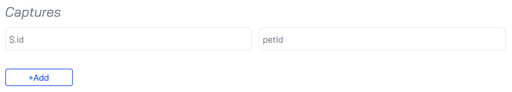

# Creating Tests

Now that you're all setup, you're ready to create your first test. 

Adding a new test is easy. From the Predator web interface, choose **Tests** > **View Tests**. Then click **Create Test** and complete all fields on the form.

With the base specification of your test in place, you can now proceed with building your test. 

!!! note
    We will use the [Pet Store API]() in all the examples that follow.

## Adding Scenarios

In Predator, a test executes one or more test **scenarios**. A scenario is a sequence of HTTP requests aimed to test the performance of a single piece of functionality. For instance, a scenario could test the performance of multiple users requesting information about a specific pet simultaneously. Another scenario could be ordering a pet from the pet store. 

To add a new scenario, create a new test or edit an existing one. Then click the **scenario** button and do the following:

* Set a **scenario weight** to set the time allocation (in %) of this scenario out of the total time allocated to run the other scenarios in your test. For example, if you set the weight to 20%, then 20% of the time allocated to run your test will be allocated to running this scenario.

* Click the **Steps** button to add **scenario steps**. This allows you to add the HTTP requests that make up the scenario. For help in understanding the request specifications, see [Anatomy of an HTTP Request](tests.md#anatomy-of-an-http-request).

## Adding a Pre-scenario Request

Sometimes a prerequisite must be fulfilled before your scenarios can actually work. For example, a pet must already have been created before you can order it from the pet store. This is where a **pre-scenario request** comes into play. A pre-scenario request is an HTTP request that Predator executes before running the scenarios in your test.

To add a pre-scenario request, create a new test or edit an existing one. Then click the **before** button and add all request specifications. For help in understanding the request specifications, see [Anatomy of an HTTP Request](tests.md#anatomy-of-an-http-request).

## Anatomy of an HTTP Request

When adding scenario steps or pre-scenario requests, you will need to define the properties of the HTTP request that will be invoked:

While most of the properties are self-explanatory, the following items may require some additional explanation:

* **gzip**: This will compress the request body to improve transfer speed and bandwidth utilization.

* **forever**: Indicates whether the request should be executed only once, or each time the test runs.

* **Captures**: Allows you to extract (capture) data from the request response and store it in a variable for reuse in another request. See [Extracting and Reusing Data from Responses](tests.md#extracting-and-reusing-data-from-responses) below.

### Extracting and Reusing Data from Responses

The **Captures** field allows you to extract (capture) data from the request response and store it in a variable for reuse in another request. Use JSONPath syntax to extract the data of your choice. In the following example we extract the `id` field and store it in a `petId` variable:

You can then use `petId` in a request by placing it between double brackets, like so:

`{{petId}}`

Here's an example of using `{{petId}}` in the request path:

### Reusing Request Bodies

Writing a performance test that checks specific parts of your API end-to-end can be a hassle, but now it is effortless. By creating definitions for each Domain Specific Language (DSL), request templates are generated. You can then reuse those templates in the same test and in other tests under the same DSL type, reducing replication.

## Running a Test

With all scenarios in place, let's go ahead and run the test.

<!-- A job executes a test at predefined intervals. When defining a test, you can specify a number of parameters such as the frequency at which the test will be executed, the number of scenarios that will be executed per second and so forth. -->

Predator executes tests through so-called **jobs**. To create a job, choose **Tests** > **View tests**. Then click **RUN** for the test you want to execute and complete all fields in the **Create new job** dialog. When done, click **SUBMIT**. Depending on your configuration, the test will either execute immediately or at scheduled intervals.

The following table explains the job parameters you can configure:

<table style="width:100%">
    <tr>
      <th>Setting</th>
      <th>Description</th> 
    </tr>
    <tr>
      <td>Notes</td>
      <td>bla</td> 
    </tr>
    <tr>
      <td>Arrival rate</td>
      <td>bla</td> 
    </tr>
    <tr>
      <td>Duration (seconds)</td>
      <td>bla</td> 
    </tr>
    <tr>
      <td>Ramp to</td>
      <td>bla</td> 
    </tr>
    <tr>
      <td>Parallelism</td>
      <td>bla</td> 
    </tr>
    <tr>
      <td>Max virtual users</td>
      <td>bla</td> 
    </tr>
    <tr>
      <td>Environment</td>
      <td>bla</td> 
    </tr>
    <tr>
      <td>Cron expression</td>
      <td>bla</td> 
    </tr>
    <tr>
      <td>Run immediately</td>
      <td>bla</td> 
    </tr>
    <tr>
      <td>New Email</td>
      <td>bla</td> 
    </tr>
    <tr>
      <td>New Webhook</td>
      <td>bla</td> 
    </tr>
  </table>

