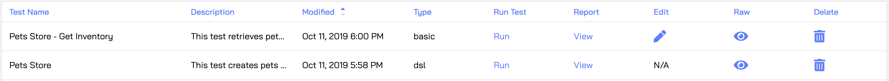

!!! note "What you should already know"
   
    We assume you have already familiarized yourself with the basic concepts used in Predator and that you successfully created your first test. If not, we strongly recommend you first complete the steps in the [My First Test](myfirsttest.md) topic before proceeding with the instructions below.


# Data Reuse with Variables

The **Captures** field of the [HTTP request properties](myfirsttest.md#http-request-properties) allows you to extract (capture) data from the request response and store it in a variable for reuse in another request. Use JSONPath syntax to extract the data of your choice. In the following example we extract the `id` field and store it in a `petId` variable:


You can then use `petId` in a request by placing it between double brackets, like so:

`{{petId}}`

Here's an example of using `{{petId}}` in the request path:


# Request Reuse with DSL Definitions

This is the moment where Predator shows its teeth and unleashes its true power. 

Writing a performance test that checks specific parts of your API end-to-end can be a huge hassle, but now it is effortless. By creating DSL definitions using Predator's Domain Specific Language (DSL), request templates are generated which you can then reuse in the same test and in other tests under the same DSL type, reducing replication.

Let's dive right in and get going with our first DSL definition. 

!!! note "Predator API"
   
    This functionality is only available through the [Predator API]().

## Creating a DSL Definition

Before you can use a DSL definition, you must create it first. You do so by invoking the [Create DSL request](). Here's an example request body for creating a DSL definition of a GET request. Notice how we use the `{{petId}}` in the url endpoint (we will create this variable in the example of a POST request DSL definition):

```JSON
{
	"name": "get-pet",
	"request": {
		"get": {
			"url": "http://127.0.0.1:3000/pets/{{petId}}"
		}	
	}
}
```

The request body for creating a DSL definition of a POST request is a bit more elaborate, since it requires that you pass in the entire body that makes up the POST request. The following example shows how to do this. Notice how we add a `capture` array, in which we define the `petId` variable for storing the pet ID. We can then reuse it in another request (like in the example of a GET request above).

```JSON
{
	"name": "create-pet",
	"request": {
		"post": {
			"url": "http://127.0.0.1:3000/pets",
			"json": {
				"name": "mickey",
				"species": "dog"
			},
			"capture": [
				{
					"json": "$.id",
					"as": "petId"
				}	
			]
		}	
	}
}
```


## Creating a Test that Uses the DSL

Tests that use a DSL definition can only be created using the [Create DSL Test]() API request. The [Create DSL Test]() API request body must include all components that make up a test, including pre-scenario requests and scenarios. However, instead of defining the entire HTTP request in each scenario step (as you would through the Predator UI), you can now reference the HTTP request through its DSL definition. You do so, using the `action` property (in the `steps` array). 

Here's an example:


```JSON
{
  "name": "Pet store",
  "description": "DSL",
  "type": "dsl", // Make sure the type is set to DSL
  "before": {
  	"steps": [
  		{
  			"action": "petstore.create-pet"
  		}	
  	]
  },
  "scenarios": [
  	{
  		"scenario_name": "Only get pet",
  		"steps": [
  			{
  				"action": "petstore.get-pet"
  			}	
  		]
  	}
  ]
}
```

There are two additional items to note:

* The `type` must always be set to `dsl`.

* The `action` value uses the following syntax: `{dsl_group_name}.{dsl_name}`, in which the `dsl_group_name` is the name used in the path of the [Create DSL Defintion]() API request. 

If you login to the Predator UI after creating the test, you will notice that the test has been added with a type of **dsl**. 



You can now run the test as you would any other. 