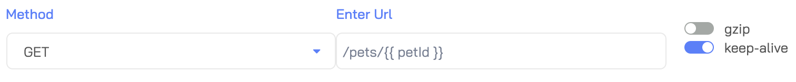

!!! note "What you should already know"
   
    We assume you have already familiarized yourself with the basic concepts used in Predator and that you successfully created your first test. If not, we strongly recommend you first complete the steps in the [My First Test](myfirsttest.md) topic before proceeding with the instructions below.

# Data Reuse with Variables

The **Captures** field of the [HTTP request properties](myfirsttest.md#http-request-properties) allows you to extract (capture) data from the request response and store it in a variable for reuse in another request. Use JSONPath syntax to extract the data of your choice. In the following example we extract the `id` field and store it in a `petId` variable:

You can then use `petId` in a request by placing it between double brackets, like so:

`{{petId}}`

Here's an example of using `{{petId}}` in the request path:

# Data Reuse with DSL Definitions

Writing a performance test that checks specific parts of your API end-to-end can be a hassle, but now it is effortless. By creating definitions for each Domain Specific Language (DSL), request templates are generated. You can then reuse those templates in the same test and in other tests under the same DSL type, reducing replication.
